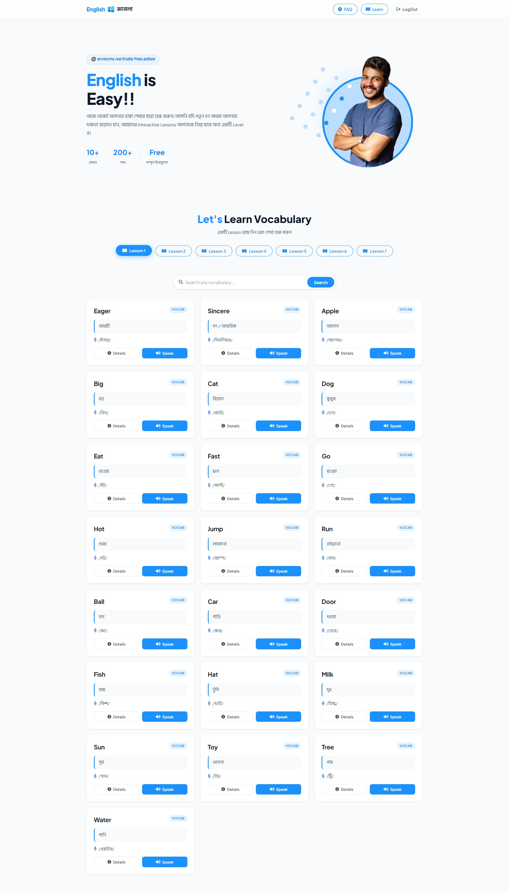
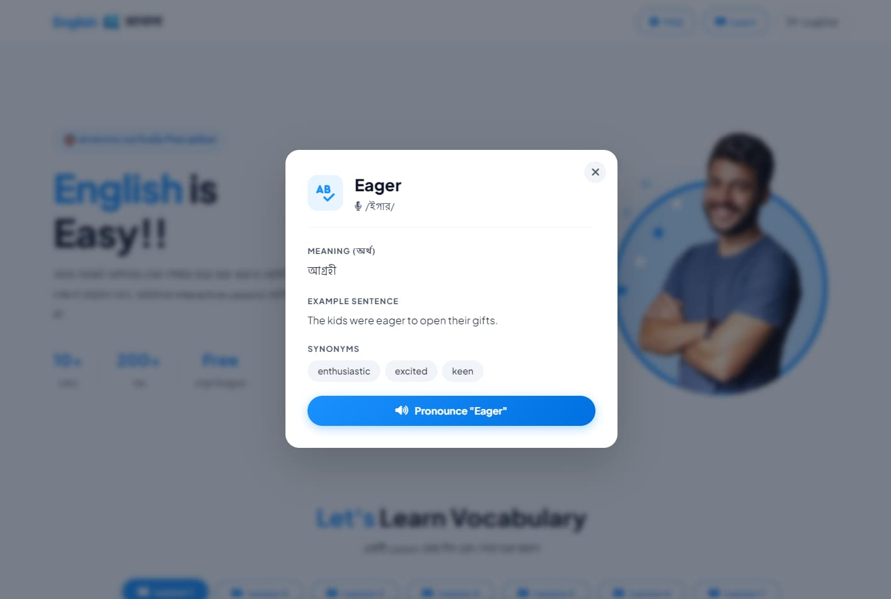

# 🪟 English Janala — Interactive Vocabulary Learning Platform

> একটি সম্পূর্ণ বাংলাদেশী ইংরেজি শিক্ষা প্ল্যাটফর্ম — শিখুন, অনুশীলন করুন, এগিয়ে যান।

---

## 🔗 Live Demo

**[👉 Live Site Link Here](https://ziaulhoquepatwary.github.io/english-janala/)** 
**[📂 Repository](https://github.com/ziaulhoquepatwary/english-janala.git)**

---

## 📸 Screenshots


| Home Page | Word Cards |
|:---------:|:----------:|
|  |  

---

## 📌 Project Overview

**English Janala** is a responsive, interactive vocabulary learning web application built with vanilla HTML, CSS, and JavaScript. It fetches real-time data from a public REST API and presents English vocabulary in a clean, engaging UI — designed specifically for Bangla-speaking learners.

---

## ✨ Features

- 📚 **Lesson-based vocabulary** — 10+ lessons fetched dynamically from API
- 🔍 **Live search** — Search across all vocabulary in real time
- 🔊 **Text-to-Speech** — Native browser speech synthesis for pronunciation
- 📖 **Word detail modal** — Meaning, pronunciation, example sentence & synonyms
- 🎨 **Fully responsive** — Mobile, tablet, and desktop friendly
- ⚡ **Smooth animations** — Card entrance, modal slide-up, hover transitions
- 🍞 **Toast notifications** — Feedback for every user action
- ⌨️ **Keyboard accessible** — Enter to search, Escape to close modal

---

## 🛠️ Tech Stack

| Technology | Usage |
|---|---|
| **HTML5** | Semantic structure |
| **CSS3** | Custom design system, animations, responsive layout |
| **Vanilla JavaScript (ES6+)** | Async/await, DOM manipulation, Web Speech API |
| **REST API** | [Programming Hero Open API](https://openapi.programming-hero.com/api) |
| **Google Fonts** | Plus Jakarta Sans + Hind Siliguri |
| **Font Awesome 6** | Icons throughout the UI |

---

## 📁 Project Structure

```
english-janala/
│
├── index.html          # Main HTML file
├── style/
│   └── style.css       # All custom styles & design system
├── script/
│   └── index.js        # All JavaScript logic
└── assets/
    ├── logo.png
    └── hero-student.png
```

---

## 🚀 Getting Started

No build tools or dependencies required. Just clone and open in a browser.

```bash
# Clone the repository
git clone https://github.com/ziaulhoquepatwary/english-janala.git

# Navigate into the folder
cd english-janala

# Open in browser
open index.html
```

> **Note:** The Speech API requires a modern browser (Chrome, Edge, Firefox). Live server (e.g. VS Code Live Server) is recommended for best experience.

---

## 💡 Key JavaScript Concepts Used

- `async/await` with `try/catch` for clean error handling
- Generic `fetchData()` helper to avoid repetitive fetch code
- DOM manipulation without any framework
- **Web Speech API** (`SpeechSynthesisUtterance`) for pronunciation
- Event delegation and dynamic rendering
- CSS class toggling for UI state management

---

## 📱 Responsive Breakpoints

| Breakpoint | Layout |
|---|---|
| `< 500px` | Single column cards, compact hero |
| `500px – 768px` | Two column cards, stacked hero |
| `> 768px` | Three column grid, side-by-side hero |

---

## 🙋‍♂️ Author

**Your Name**
- GitHub: [ziaulhoquepatwary](https://github.com/ziaulhoquepatwary)
- LinkedIn: [ziaulhoquepatwary](https://www.linkedin.com/in/ziaulhoquepatwary/)

---

## 📄 License

This project is open source and available under the [MIT License](LICENSE).

---

<p align="center">Made with ❤️ for Bangla learners</p>